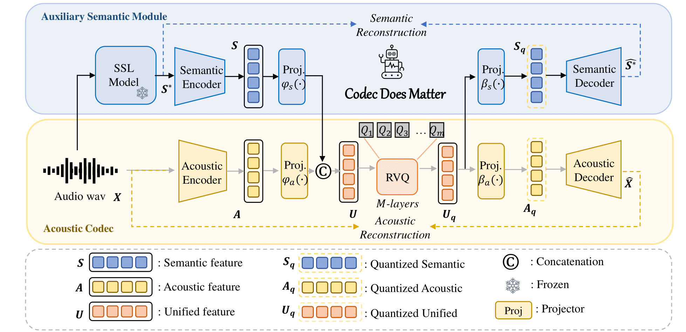
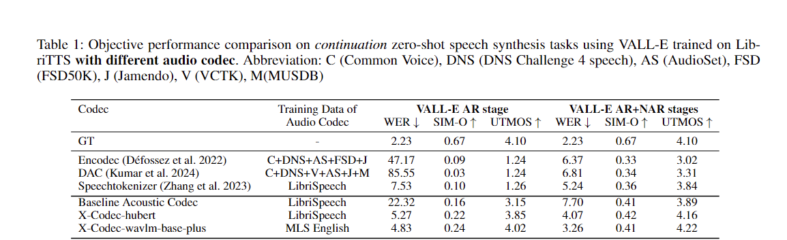

# X-Codec

# Paper
**Title**: Codec Does Matter: Exploring the Semantic Shortcoming of Codec for Audio Language Model

**Authors**: Zhen Ye, Peiwen Sun, Jiahe Lei, Hongzhan Lin, Xu Tan, Zheqi Dai, Qiuqiang Kong, Jianyi Chen, Jiahao Pan, Qifeng Liu, Yike Guo*, Wei Xue*



# Experiments on VALL-E


# ckpts

Speech ckpts [downlaod link](https://drive.google.com/file/d/1oF1_R0Z2JNnqdPbuqiL8tJeY6pDwuQG1/view?usp=sharing)
 
General audio ckpts [Soon]

# Inference

```bash
python inference.py
```

# Training
```bash
torchrun --nnodes=1 --nproc-per-node=8 main_launch_vqdp.py
```

## Acknowledgement
I would like to extend a special thanks to authors of Uniaudio and DAC, since our code base is mainly borrowed from  [Uniaudio](https://github.com/yangdongchao/UniAudio/tree/main/codec) and [DAC](https://github.com/descriptinc/descript-audio-codec).
